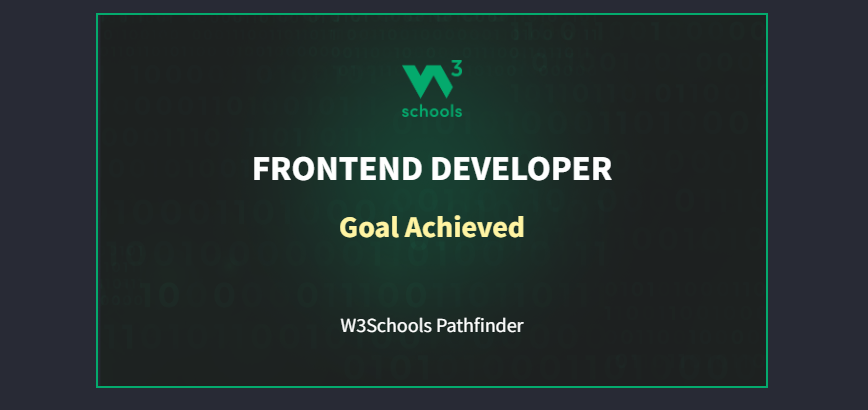

<!--- 👋 Hi, I’m Eranga Madhushan.I'm a BCS student in University of Ruhuna,Sri Lanka
- 👀 I’m interested to learn advance programming concepts.
- 🌱 I’m currently learning key concepts in javascript and several front-end frameworks and libraries(like Bootstrap,jquery,angularJS,animeJS) and also Currently I am learning C and Go programming languages 🧑‍💻
- 💞️ I’m looking to collaborate on front-end development projects. I'll do my best for your project.
- 📫 You can contact me by e-mail erangamadhushann956@gmail.com

- ❕❕EM956❕❕-->

<h1 align="center">Hi 👋, I'm Eranga Madhushan</h1>
<h3 align="center">A passionate frontend developer from Sri Lanka ❕❕</h3>
<h2 align="center">
  
</h2>

  

<table align="center"> <tr align="center"> </tr></table>

<table align="center">
  <tr align="center">
    <td align="center">
      <h2> About Me</h2>
      
- 🔭 I’m currently working on ** Web Pack 01 Project**

      
- 🌱 I’m currently learning **key concepts in javascript and several front-end frameworks and libraries(like Bootstrap,jquery,angularJS,animeJS) and also Currently I am learning C and Go programming languages 🧑‍💻**

      
- 👯 I’m looking to collaborate on **front-end development projects. I'll do my best for your project.**

      
- 💬 Ask me about **angularJS and jquery**

      
- 📫 How to reach me **by e-mail erangamadhushann956@gmail.com**

      
- ⚡ Fun fact **Coding...**

    </td>
    
  </tr>
</table>

<h1>Studying</h1>
- Currently pursuing a degree in Computer Science at the University of Ruhuna, Sri Lanka. 
- Let's build amazing things together. 🌟
- <h1>Remember : Practice Makes Perfect</h1>

<!--

  
  

-->

<table align="center">
  <tr>
    <td width="50%" align="center">
      <h3 align="left"> Connect with me:</h3>

<!--  -->

<!---->

    </td>
    <td>
       
 
 
    </td>
  </tr>
</table>

  <h1 align="left"> Skills</h1>
  <table align="center">
    <tr border="none">
      <td width="50%" align="center">
          
        <h4>Front-End Development</h4>
        
 
        
        
        
        
        
        
        

          
      </td>
      <td width="50%" align="center">
          
            <h4>Back-End Development</h4>
            

            
            
            

          
      </td>
    </tr>
    
  </table>
  <table align="center">
    <tr border="none">
      <td width="50%" align="center">
        
          <h4>Programming Languages</h4>
          

           
          
          

        
      </td>
      <td width="25%" align="center">
        
          <h4>Designing Tools</h4>
          

          
          
          

        
      </td>
    </tr>
    <tr>
      <td width="50%" align="center">
          
            <h4>DataBase Management Systems</h4>
            

            
            
            

          
      </td>
      <td width="50%" align="center">
        
          <h4>Development Tools</h4>
          

          
          
          
          
          
          

        
      </td>
    </tr>
  </table>

  <table align="center">
    <tr align="center">
      <td width="50%" align="center">
        
          <h4>Operation System Knowladge</h4>
          

          
          
          

        
      </td>
    </tr>
  </table>
  

<!-- 
 -->
<h1>Github Performances</h1>
<table align="center">
<tr border="none">
<td width="50%" align="center">
  
  
    
   
</td>

<td width="50%" align="center">

  
  
  </td>
 
</tr>
</table>

<!--   

 -->
<!--   
&nbsp;

  

 -->

<table align="center" border="none">
  <tr align="center">
    <td align="center" width="50%">
      
      <a href="https://eranga956.blogspot.com" target="_blank">eranga956.blogspot.com</a> 
    </td>
    <td align="center" width="50%">
       
      <a href="https://t.me/neonWebDevelopers" target="_blank"> Web Development </a> 
    </td>
  </tr>
  <tr>
    <td width="50%" align="center">
       
      <a href="https://stackoverflow.com/users/25121697/eranga-madhushan" target="_blank" >Eranga Madhushan(EM956)</a>
    </td>
    <td align="center" width="50%">
       
      <a href="#" target="_blank" >Web Development</a>
    </td>
  </tr>
</table>

  <h1>Achievments</h1>
  

    

Last Edited on 17/11/2024

<!--!
-
Erangamad
hushan/Erangamadhushan is a ✨ special ✨ repository because its `README.md` (this file) appears on your GitHub profile.
You can click the Preview link to take a look at your changes.
--->

